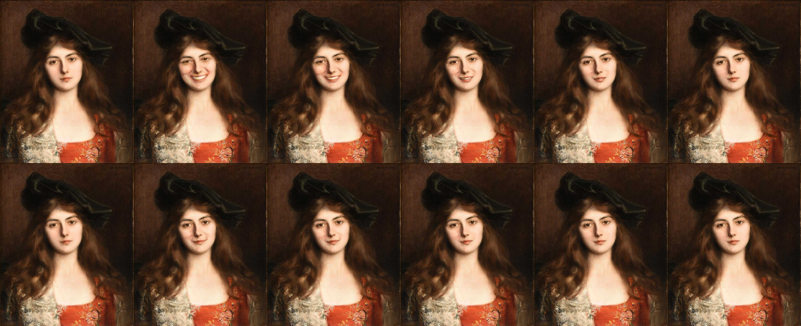

# SayCheese
# GANimation: Anatomically-aware Facial Animation from a Single Image


Official implementation of [GANimation](http://www.albertpumarola.com/research/GANimation/index.html). In this work we introduce a novel GAN conditioning scheme based on Action Units (AU) annotations, which describe in a continuous manifold the anatomical facial movements defining a human expression. Our approach permits controlling the magnitude of activation of each AU and combine several of them. 

<!-- This code was made public to share our research for the benefit of the scientific community. Do NOT use it for immoral purposes.
 -->

Check out the repo for our ios app https://github.com/JinchengKim/Cruzhacks_iOS





## Prerequisites
- Install PyTorch (we use version 1.0.0), Torch Vision and dependencies from http://pytorch.org
- Install requirements.txt (```pip install -r requirements.txt```)

## Run

First, one must put the pretrained model(s) anywhere you like, they are files named **net_epoch_#epoch_id_G.pth** and **net_epoch_#epoch_id_D.pth** (#epoch refers to the index of epoch)

To run the demo:
```
python feedforward.py \
--model_path path/to/pretrained_model \
--load_epoch index_of_epoch_for_the_model \
--img_path path/to/img
```

## Citation
Our idea and work are based on Albert Pumarola's [GANimation](http://www.albertpumarola.com/images/2018/GANimation/teaser.png). For more information about the model please refer to the [[Project]](http://www.albertpumarola.com/research/GANimation/index.html) and [[paper]](https://arxiv.org/abs/1807.09251).
```
@inproceedings{pumarola2018ganimation,
    title={GANimation: Anatomically-aware Facial Animation from a Single Image},
    author={A. Pumarola and A. Agudo and A.M. Martinez and A. Sanfeliu and F. Moreno-Noguer},
    booktitle={Proceedings of the European Conference on Computer Vision (ECCV)},
    year={2018}
}
```
